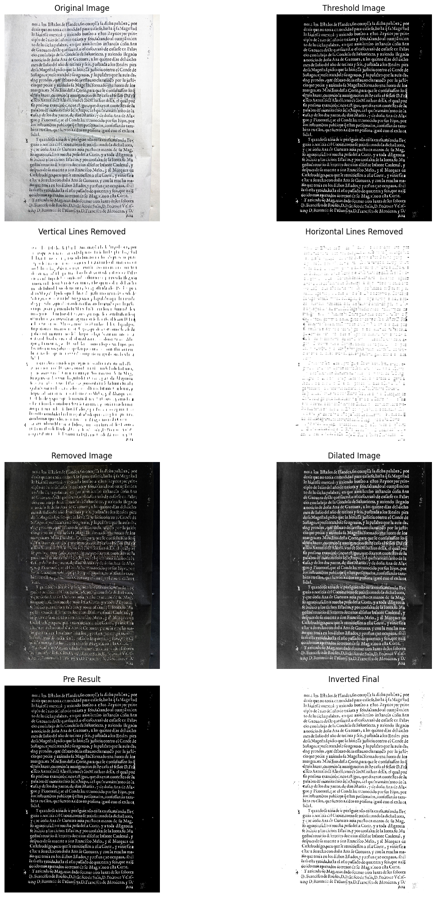

<div align="center">
  
  
  
  <br>
</div>

The implementation of the Transformer model in this project is based on the techniques described in [this Medium article](https://medium.com/@khanarsh0124/gsoc-2024-with-humanai-text-recognition-with-transformer-models-de86522cdc17) by Arsh Khan for GSoC 2024 with HumanAI (2024).

# Problem Statement
To build a model based on convolutional-recurrent, transformer, or self-supervised architectures for optically recognizing the text of each data source. THe model should be able to detect the main text in each page, while disregarding other embellishments. Pick the most appropriate approach and discuss the strategy.

# :bar_chart:Dataset
The dataset consists of 6 scanned early modern printed sources. The images have a simple recognition applied that reflects the limitations of the OCR already used (missed letters, incorrectly recognized words...), each source is saved as separate PDF file.<br>

The dataset also includes a transcription of the first 3 pages of each PDF source – they should be used as reference while training the AI models for the project.

# :arrow_forward:Approach

## Data Preprocessing

### 1. Conversion to PNG Image
The Pdf files are processed and each page is stored as a PNG file.<br>
Denoising and Thresholding:
```python
gray = cv2.fastNlMeansDenoising(gray, None, 30, 7, 21)
thresh = cv2.threshold(gray, 0, 255, cv2.THRESH_BINARY_INV + cv2.THRESH_OTSU)[1]
```
Line Removal:
```python
# Vertical Lines
vertical_kernel = cv2.getStructuringElement(cv2.MORPH_RECT, (1, 40))
remove_vertical = cv2.morphologyEx(thresh, cv2.MORPH_OPEN, vertical_kernel, iterations=2)

# Horizontal Lines
horizontal_kernel = cv2.getStructuringElement(cv2.MORPH_RECT, (40, 1))
remove_horizontal = cv2.morphologyEx(thresh, cv2.MORPH_OPEN, horizontal_kernel, iterations=2)
```
Image Repair and Enhancement:
```python
repair_kernel = cv2.getStructuringElement(cv2.MORPH_ELLIPSE, (3, 3))
removed = 255 - removed
dilate = cv2.dilate(removed, repair_kernel, iterations=5)
```

<div align="center">
  
  <br>
</div>

Then we employ a custom trained U-Net Segmentation Model modified with attention mechanism to identify the text region and crop the images by identifing the contour regions<br>

<div align="center">
  
  <br>
</div>

### 2. Line Segmentation
- We convert the image to binary format with text being white and background black
- Calculate the Horizontal Projection Profile(HPP)
- Set a threshold value to identify peak regions corresponfing to text lines
```python
threshold = (np.max(hpp)-np.min(hpp))/2
```
<div align="center">
  
  <br>
</div>


- We use A* Path Finding Algorithm to identify text lines and segment the image

<div align="center">
  
  <br>
  <b>Segmented Iamges</b>
</div>

### 3. Text and Image Alignment
- Segmented text images are aligned with their respective text segemnets
- There were some wrong segmented images which had to be manually pruned but in future this process should be automated

## :microscope:Data Augmentations

```python
augmentations = [
        A.Rotate(limit=3, p=1.0),
        A.GaussNoise(var_limit=(10.0, 50.0), p=1.0),
        A.ElasticTransform(alpha=0.3, sigma=100.0, p=1.0),
        A.OpticalDistortion(distort_limit=0.03, shift_limit=0.03, p=1.0),
        A.CLAHE(clip_limit=2, tile_grid_size=(4, 4), p=1.0),
        A.Affine(scale=(0.95, 1.05), translate_percent=(0.02, 0.02), shear=(-2, 2), p=1.0),
        A.Perspective(scale=(0.01, 0.03), p=1.0),
        A.RandomBrightnessContrast(brightness_limit=0.1, contrast_limit=0.1, p=1.0),
        A.GaussianBlur(blur_limit=(3, 7), p=1.0),
        A.GridDistortion(num_steps=3, distort_limit=0.02, p=1.0),
        A.HueSaturationValue(hue_shift_limit=10, sat_shift_limit=10, val_shift_limit=10, p=1.0),
        A.MedianBlur(blur_limit=(3, 5), p=1.0),  # Ensures odd kernel size
    ]
```

## Vision Transformers (ViT)
We use the [qantev/trocr-small-spanish](https://huggingface.co/qantev/trocr-small-spanish) and [qantev/trocr-large-spanish](https://huggingface.co/qantev/trocr-large-spanish) pretrained model
<br>

Evaluation Metric used for training the model is Character Error Rate(CER)
### Optimiser
```python
optimizer = AdamW(model.parameters(),
                      lr=training_args.learning_rate,
                      weight_decay=1e-2,
                      betas=(0.9, 0.999),
                      eps=1e-8)                 
  ```
### Schedulers
The Cosine Scheduler increases the learning rate linearly from 0 to the initial value during the warm-up phase, then applies a cosine decay, reducing the learning rate toward 0 over the remaining steps.
```python
scheduler = get_cosine_schedule_with_warmup(optimizer,
                                                num_warmup_steps=1000,
                                                num_training_steps=num_training_steps)             
  ```
### Regularization
- Temperature Scaling involves scaling the logits by dividing them by a scalar parameter T (temperature). A higher value of T reduces the confidence of the model’s predictions by flattening the softmax output, while lower values increase it.

### Loss Function

- #### Beam search :
Beam search loss is a decoding strategy integrated into sequence generation models to optimize output quality by maintaining a fixed number of top candidate sequences at each step (the beam width).<br>

<div align="center">
  
  <br>
  <b>Refinements to Beam Search</b>
</div>

- #### Focal Loss
Focal Loss is a modification of cross-entropy loss designed to address class imbalance by focusing more on hard-to-classify examples.<br>

<div align="center">
  
  <br>
  <b>Focal Loss</b>
</div>

## Sequence Likelihood Calibration (SLiC)
SLiC represents a natural extension of the current pretraining and fine-tuning paradigm, offering a more calibrated and robust approach to sequence generation, by calibrating sequence likelihoods directly in the model’s latent space.<br>
<div align="center">
  
  <br>
  <b>Objective Function of SLiC</b>
</div>

### Key Components
- Decoding Candidates:<br>
SLiC starts by decoding multiple candidate sequences from a fine-tuned model using standard decoding techniques like beam search or nucleus sampling. These candidate sequences are then used as the foundation for further calibration.

- Similarity Function:<br>
The similarity function measures the alignment between candidate output and target sequences by comparing their decoder output hidden state representations. It computes cosine similarities over token spans and aggregates them using an modified F-measure, focusing on spans of varying lengths.

- Positive and Negative Candidates:<br>
These are sequences that the model generates that are more or less similar to the target sequence, according to some similarity metric . A high similarity score indicates that the candidate is close to the true sequence in terms of content or structure (Positive Candidates). A lower similarity score indicates that these candidates deviate more from the true sequence (Negative Candidates).

- Calibration Loss:<br>
The calibration loss is designed to align the sequence likelihood of the model's decoded candidates with their similarity to the target sequence. Given the context, the target sequence and a set of candidate sequences, four distinct loss types are considered to optimize.

<div align="center">
  
  <br>
  <b>Different Calibration Losses</b>
</div>

Rank Loss: Ensures positive candidates rank higher than negative ones.<br>
Margin Loss: Increases the probability gap between positive and negative candidates.<br>
List-wise Rank Loss: Optimizes the ranking of a list of candidates.<br>
Expected Reward Loss: Maximizes expected similarity across a list of candidates.<br>

- Regularization Loss:<br>
Regularization losses are applied to prevent the model from deviating significantly from the original MLE objective.<br>
<div align="center">
  
  <br>
  <b>KL Divergence as Regularization Loss </b>
</div>

### Validation
- 10% of total dataset was used for validation at each 300 steps
- Validation was performed in chunks to reduce memory consumption

# :diamonds:Results
Both the samll and large model were trained for 10 epochs<br>
Final Results:<br>
|Model|WER|CER|
|---|---|---|
|Small|0.43856|0.28494|
|Large (Image size=(256,64))|0.151|0.11681|
|Large (Image size=(128,32))|0.076527|0.039325|

- It is found that training the model with lower segemnted image size performs much better than with higher image size. It is also more stable during training

<div align="center">
  
  
  
  <br>
</div>
